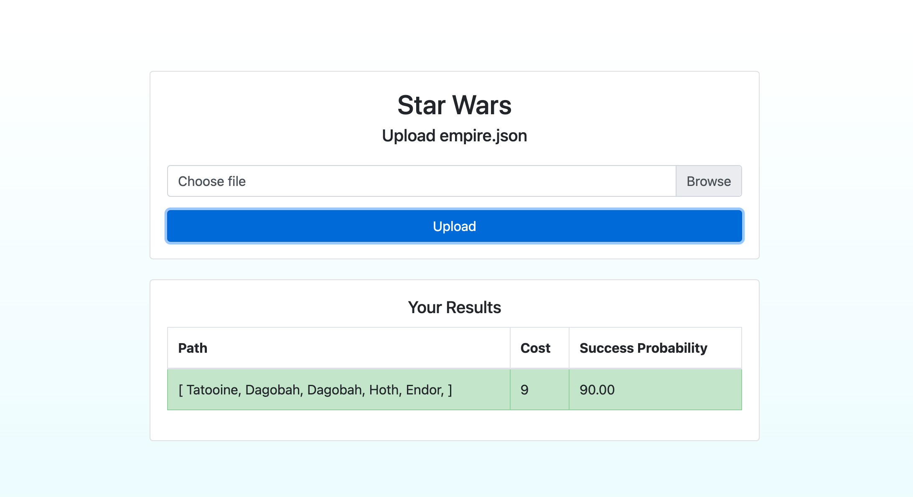

# Millennium Falcon


## Launch Application

## Docker

The project can be run in a Docker container. You can create a Docker image from the application and deploy it to a Docker container for easier deployment and portability of the application. Make sure you have Docker installed on your system before continuing.

To create a Docker image of the application, use the following command:

```bash
docker build -t millenium-falcon .
```

Une fois la construction terminée, vous pouvez exécuter le conteneur Docker en utilisant la commande suivante :
```bash
docker run -p 8080:8080 millenium-falcon
```
## Maven

To build the project, run the following command:

```bash
mvn clean verify
```

To launch the application, run the following command:
argument : millenium-falcon.json
```bash
mvn spring-boot:run -Dspring-boot.run.arguments=[PATH_TO_INITIALIZATION_FILE]
```

## Backend API

The backend API will be serving requests at the following URL:

POST : http://localhost:8080/c3po/intercept
Accepts empire a JSON object containing Empire interceptions as described in the specification.


GET : http://localhost:8080/c3po/file?filePath=/app/empire.json
Accepts file path of empire.json

## API docs

- Swagger UI : http://localhost:8080/swagger-ui/index.html

## Launch GUI
To launch the GUI, visit:

http://localhost:8080




##  CLI Command
To interact with the CLI (Command Line Interface), you can use curl to make HTTP requests to the backend API. Here's an example command:

```bash
curl "http://localhost:8080/c3po/file?filePath=/app/empire.json"
```
This command sends a GET request to the specified endpoint, passing the file path as a query parameter. Ensure that the backend is running and accessible at the provided URL.